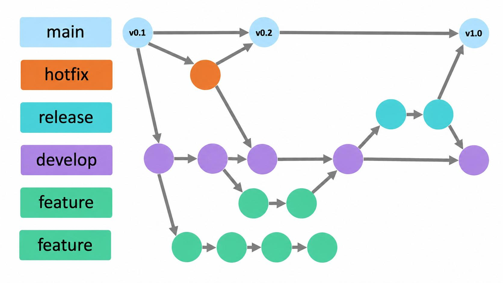

# 🏠 Dwell — Backend

<p align="center">
  <b>English</b> | <a href="./README.ko.md">한국어</a>
</p>

> A proactive case agent that helps non-native English-speaking tenants in NYC document, escalate, and resolve housing issues.
> Built for the **Nebius × NVIDIA Global AI Hackathon**.

## 🛠 Tech Stack

| Category | Stack |
| :--- | :--- |
| Language | Java 21 |
| Framework | Spring Boot 4, Spring Security (JWT), Spring Data JPA |
| Database | PostgreSQL 17, Flyway |
| API Docs | springdoc-openapi (Swagger UI) |
| Infra | Docker, GitHub Actions, Nebius AI Cloud |
| AI | NVIDIA Nemotron via Nebius Token Factory |

## 🚀 Getting Started

```bash
# 1. Create your local env file (never commit .env)
cp .env.example .env

# 2. Build the jar and start PostgreSQL + the app
./gradlew bootJar
docker compose --env-file .env -f docker/docker-compose.yml up -d --build
```

- Swagger UI: http://localhost:8080/swagger-ui.html

<br>

## 🌿 Branch Convention

We keep separate branches for stable releases and independent feature development.

* 🔵 **`main`** : Production branch, always deployable (no direct commits, PR merges only)
* 🟠 **`hotfix`** : Urgent fixes for production bugs (branched from `main`, merged back into both `main` and `develop`)
* 🟡 **`release`** : Final QA and bug fixes before a release (branched from `develop`, merged into both `main` and `develop`, then `main` is tagged with the version)
* 🟣 **`develop`** : Integration branch for the next release (all feature work lands here)
* 🟢 **`feature branches`** : Per-feature/issue branches created from `develop`



<br>

## 📌 Branch Naming Convention
* **Format:** `prefix/#issue-number-description` (kebab-case)
* **Examples:** `feat/#10-login-api`, `chore/#1-setting-base`

| Prefix | Description | Example |
| :--- | :--- | :--- |
| `feat` | New feature | `feat/#10-login-api` |
| `fix` | Bug fix | `fix/#23-header-layout` |
| `docs` | Documentation (README, etc.) | `docs/#5-update-readme` |
| `style` | Code formatting (no logic change) | `style/#12-format-code` |
| `refactor`| Code refactoring | `refactor/#30-user-service` |
| `chore` | Config changes, build, packages, etc. | `chore/#1-setting-base` |
| `hotfix` | Urgent production fix (branched from `main`) | `hotfix/#40-login-error` |
| `release` | Release preparation (branched from `develop`, uses a version instead of an issue number) | `release/v1.0.0` |

<br>

## 📝 Commit Convention

| Emoji | Type | Description |
|--------|------|------|
| 🎉 `Start` | Project init | Project creation and initial setup (`:tada:`) |
| ✨ `Feat` | New feature | Implement a new feature (`:sparkles:`) |
| 🐛 `Fix` | Bug fix | Resolve a bug (`:bug:`) |
| 🚑 `Hotfix` | Urgent fix | Critical hotfix (`:ambulance:`) |
| 🎨 `Design` | UI / CSS | UI design changes (`:art:`) |
| ♻️ `Refactor` | Refactoring | Improve code structure (`:recycle:`) |
| 🔧 `Settings` | Configuration | Environment or config file changes (`:wrench:`) |
| 🗃️ `Comment` | Comments | Add or update comments (`:card_file_box:`) |
| ➕ `Dependency/Plugin` | Dependencies | Add libraries or plugins (`:heavy_plus_sign:`) |
| 📝 `Docs` | Documentation | Update documentation (`:memo:`) |
| 🔀 `Merge` | Merge | Merge branches (`:twisted_rightwards_arrows:`) |
| 🚀 `Deploy` | Deployment | Deployment-related work (`:rocket:`) |
| 🚚 `Rename` | Rename | Rename or move files/folders (`:truck:`) |
| 🔥 `Remove` | Remove | Delete files or code (`:fire:`) |
| ⏪️ `Revert` | Revert | Roll back to a previous version (`:rewind:`) |

* **Format:** `:gitmoji: Type: description (#issue-number)`
* **Example:** `✨ Feat: add tenant signup API (#10)`

<br>

## 🔀 Flow

1. Create a working branch (`feat`, `fix`, `chore`, `docs`, etc.) from `develop`.
2. Commit your work following the commit convention.
3. Open a Pull Request and request reviews from teammates.
4. Merge into `develop` after the review is approved.
5. At release time, create a `release/vX.Y.Z` branch from `develop` for final QA and bug fixes.
6. Merge the `release` branch into both `main` and `develop`, then tag `main` with the version (e.g. `v1.0.0`) and deploy.
7. For urgent production bugs, create a `hotfix` branch from `main`, then merge it back into both `main` and `develop`. <br>
#### Example:
```bash
# Create a new feature branch
git checkout -b feat/#issue-number-description

# Commit & push to the remote repository
git add .
git commit -m "✨ Feat: feature description (#issue-number)"
git push origin feat/#issue-number-description

# ➡️ Open a Pull Request on GitHub
#    base: develop ← compare: feat/#issue-number-description
#    Merge into develop after code review
```
